# Natural_language_processing
## By Franklin Vaca
Use of natural language processing: NLTK. tokenization, n-grams, word clouds, NER and Sentiment Analysis in Crypto. 
The news articles used for this analysis came from newsapi.org
Date: 09/18/2021

## **1. Sentiment Analysis**
### **1.1: Which coin had the highest mean positive score?** 
>
Bitcoin had a slightly higher mean positive score than Ethereum (BTC: 0.0643 vs ETH: 0.0641)
 
### **1.2: Which coin had the highest positive score?** 
>
Ethereum had the highest positive score at 0.288 compared to Bitcoin (BTC Positive Max: 0.213)
 
### **1.3: Which coin had the highest negative score?** 
>
Ethereum had the highest negative score at 0.312 compared to Bitcoin (BTC Negative Max: 0.208))
 
### **1.4: Which coin had the highest compound score?** 
>
Ethereum had the highest compound score at 0.844 compared to Bitcoin (BTC Compound Max: 0.811)
 

*Summary Statistics of Sentiment Scores for Bitcoin*

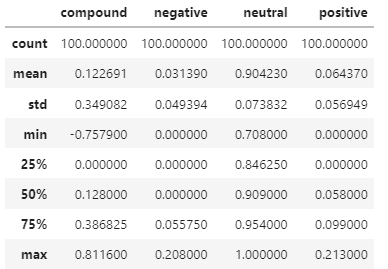

*Summary Statistics of Sentiment Scores for Ethereum*

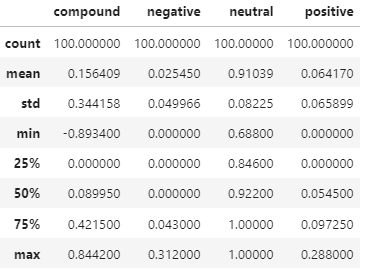

## **2. Natural Language Processing**
### **2.1: Tokenizer** 

*Tokenizer - Bitcoin (Only first five news articles shown here)*

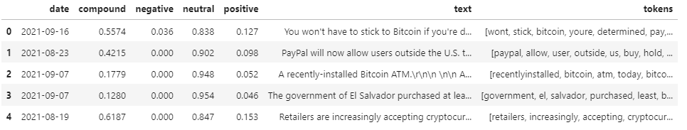

*Tokenizer - Ethereum (Only first five news articles shown here)*

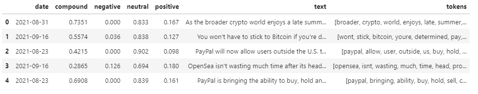

### **2.2. NGrams and Frequency Analysis** 

*Bitcoin N-grams where N=2*

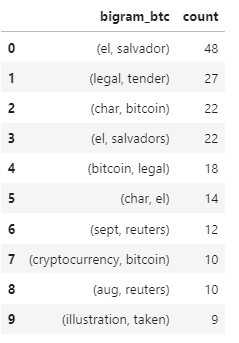

*Ethereum N-grams where N=2*

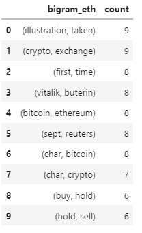

*Bitcoin News Articles Top 10 words*

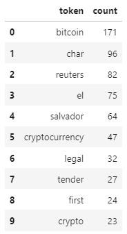

*Ethereum News Articles Top 10 words*

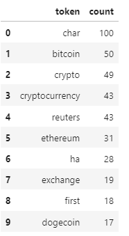

### **2.2. Word Clouds** 

*Bitcoin Word Cloud*

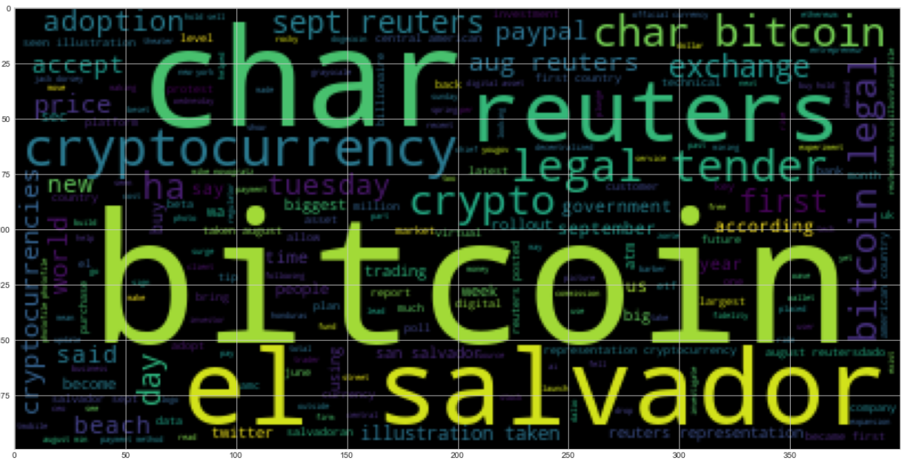

*Ethereum Word Cloud*

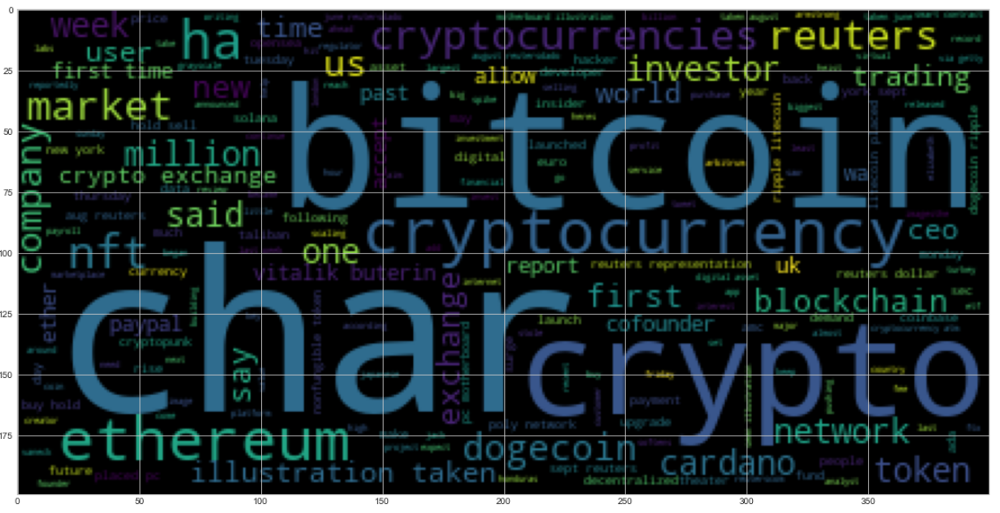

## **2. Named Entity Recognition**
### **2.1: Bitcoin NER** 

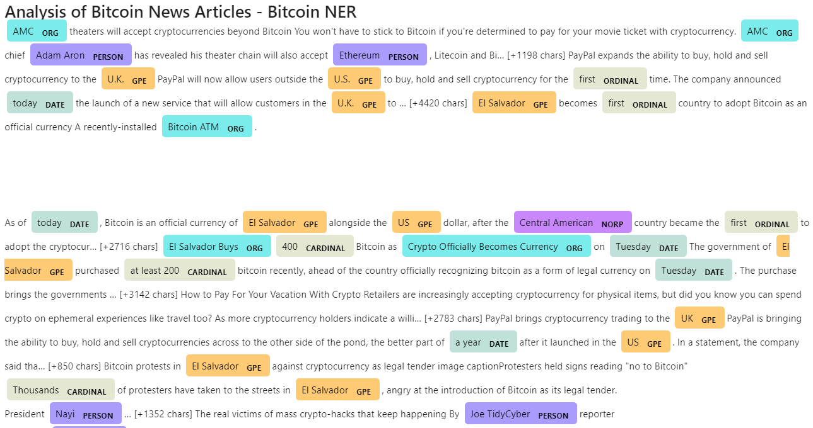

### **2.2: Bitcoin NER - Entity Word Cloud (GPE, PERSON, NORP)** 

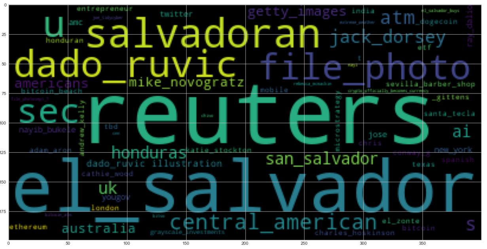

### **2.3: Ethereum NER** 

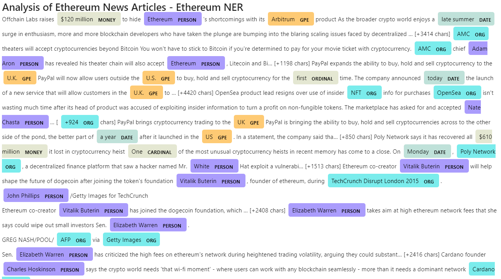

### **2.4: Ethereum NER - Entity Word Cloud (GPE, PERSON, NORP)** 

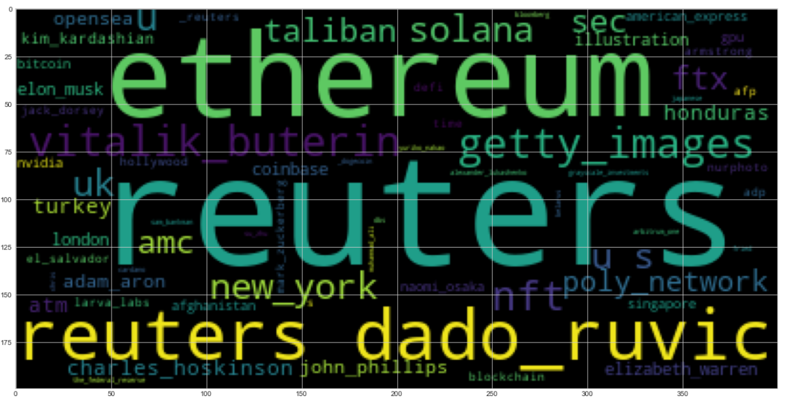